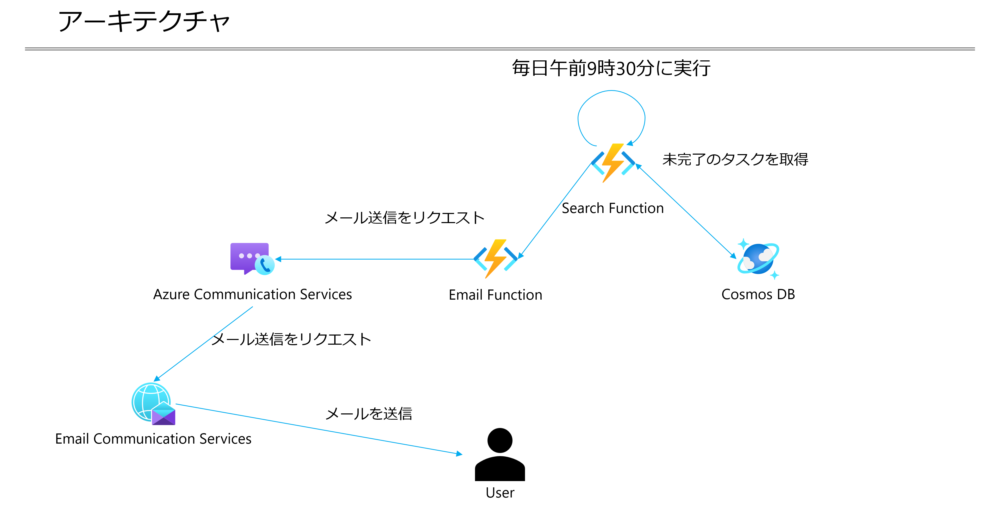

# Azure Communication Services を使ったリマインダーサンプル

## Architecture

## デプロイ方法

- Azure リソースのデプロイ

    - 以下のボタンをクリックし、パラメータを入力。

## Azure での本アプリケーション実行方法

### 以下の環境変数を Azure Functions にセット

| Key | Value |
| :--- | :--- |
| `COSMOSDB_ENDPOINT` | Cosmos DB のエンドポイント。 |
| `COSMOSDB_KEY` | Cosmos DB のプライマリキー。 |
| `SENDER_API_ENDPOINT` | Azure Functions (`SendEmail`) のエンドポイント。 |
| `SENDER_API_PATH` | `/SendEmail` |
| `EMAIL_SENDER` | Azure Email Communication Services ドメインの `MailFrom` 値。 |
| `COMMUNICATION_SERVICES_CONNECTION_STRING` | Azure Communication Services 接続エンドポイント。 |

Refs: [App Service アプリを構成する](https://docs.microsoft.com/ja-jp/azure/app-service/configure-common?tabs=portal)

### Email Communication Service リソースの作成

2022年6月26日現在、Email Communication Service は、ARM テンプレートでは作成がサポートされていません。そのため、Azure Portal でリソースを作成する必要があります。

作成手順は、下記 Docs に従ってください。

Refs: [クイック スタート: Azure Communication Service でメール通信サービスのリソースを作成して管理する](https://docs.microsoft.com/ja-jp/azure/communication-services/quickstarts/email/create-email-communication-resource)