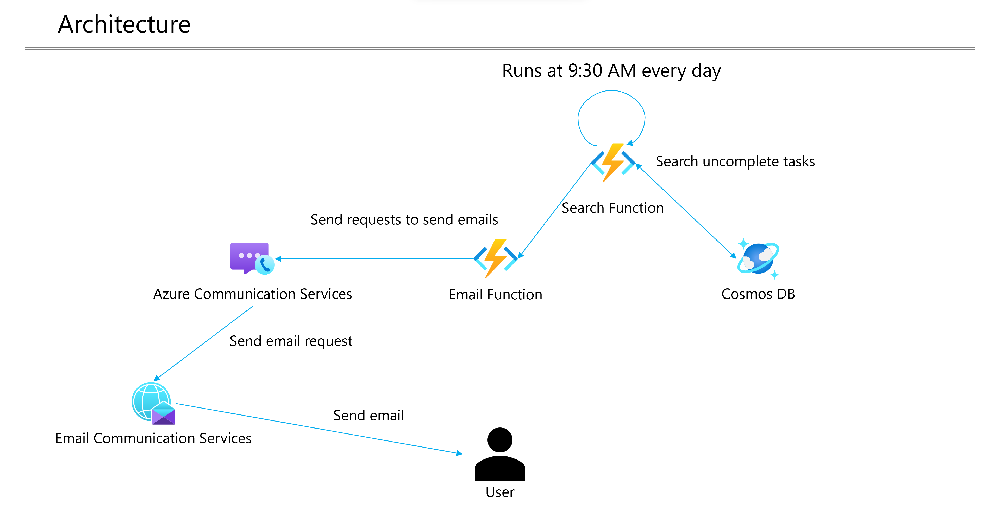

# Reminder with Azure Communication Services

## Architecture

## How to Deploy

- Deploy Azure Resources

    - Just click the below button

## How to run this application on Azure

### Set below environment variables to App Service

| Key | Value |
| :--- | :--- |
| `COSMOSDB_ENDPOINT` | A Cosmos DB endpoint. |
| `COSMOSDB_KEY` | A primary key for Cosmos DB. |
| `SENDER_API_ENDPOINT` | An Azure Functions (`SendEmail`) endpoint. |
| `SENDER_API_PATH` | `/SendEmail` |
| `EMAIL_SENDER` | `MailFrom` in Azure Email Communication Services Domain. |
| `COMMUNICATION_SERVICES_CONNECTION_STRING` | Azure Communication Services connection endpoint. |

Refs: [Configure an App Service app](https://docs.microsoft.com/en-us/azure/app-service/configure-common?tabs=portal)

### Create Email Communication Service resource

As of June 26th 2022, Email Communication Service resource is not supported in ARM Template. You have to create this using Azure Portal.

Refs: [Quickstart - Create and manage Email Communication Service resource in Azure Communication Service](https://docs.microsoft.com/en-us/azure/communication-services/quickstarts/email/create-email-communication-resource)